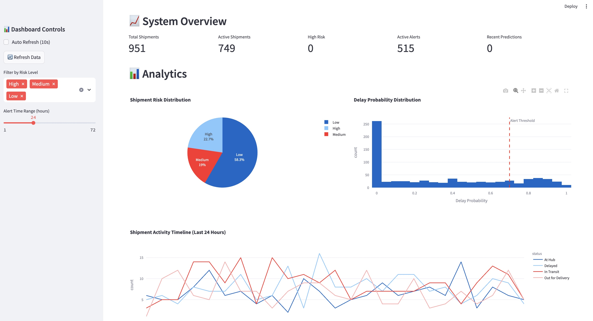

# Smart Delay Detection and Escalation System

A production-ready real-time supply chain monitoring system that predicts shipment delays and triggers automated alerts using Apache Kafka, Apache Airflow, PostgreSQL, and Streamlit.

## 🚀 Features

- **Real-time Data Streaming**: Kafka producer simulates live shipment updates
- **Automated ML Pipeline**: Hourly Airflow DAG for delay prediction using Random Forest
- **Interactive Dashboard**: Streamlit app with live shipment tracking and risk indicators
- **Intelligent Alerting**: Automated escalation system for high-risk deliveries
- **Production Ready**: Docker containerized with proper logging and error handling

## 🏗️ Architecture

```
┌─────────────────┐    ┌─────────────────┐    ┌─────────────────┐
│   Kafka         │    │   Apache        │    │   PostgreSQL    │
│   Producer      │───▶│   Airflow       │───▶│   Database      │
│   (Shipments)   │    │   (ML Pipeline) │    │   (Storage)     │
└─────────────────┘    └─────────────────┘    └─────────────────┘
                                 │
                                 ▼
                       ┌─────────────────┐
                       │   Streamlit     │
                       │   Dashboard     │
                       └─────────────────┘
```

- **Kafka**: Streams real-time shipment updates to the system.
- **Airflow**: Orchestrates the ML pipeline, consuming data from Kafka, storing it in PostgreSQL, and running delay predictions.

## 🛠️ Quick Start

### Using Docker Compose (Recommended)

```bash
# Start all services
# This includes Kafka, Airflow, PostgreSQL, and Streamlit
# Ensure Docker Desktop is running

docker-compose up -d

# View logs
docker-compose logs -f

# Access services
# Streamlit Dashboard: http://localhost:8501
# Airflow UI: http://localhost:8080 (admin/admin)
# PostgreSQL: localhost:5432
```

### Manual Setup

```bash
# Install dependencies
pip install -r requirements.txt

# Set up environment variables
cp .env.example .env

# Initialize database
python db/init_db.py

# Start Kafka producer
python kafka/producer.py

# Start Airflow (in separate terminals)
airflow webserver -p 8080
airflow scheduler

# Start Streamlit dashboard
streamlit run dashboard/app.py
```

## 📊 ML Model Performance

The system uses a Random Forest classifier with the following features:
- Distance remaining
- Vehicle speed
- Weather conditions
- Traffic levels
- Historical delay patterns

Expected accuracy: ~85-90% for delay prediction.

## 🔧 Configuration

Key environment variables in `.env`:
- `KAFKA_BOOTSTRAP_SERVERS`: Kafka broker addresses
- `KAFKA_TOPIC`: Kafka topic for shipment updates
- `DATABASE_URL`: PostgreSQL connection string
- `SLACK_BOT_TOKEN`: For alert notifications
- `ML_MODEL_PATH`: Path to trained model

## 📈 Monitoring

- **Airflow UI**: Monitor DAG runs and task status
- **Streamlit Dashboard**: Real-time shipment status and alerts
- **Database Metrics**: Query performance and data volume
- **Kafka Metrics**: Topic throughput and consumer lag
- **Airflow Logs**: Check task execution and errors

## 🚨 Alerting

The system triggers alerts when:
- Predicted delay probability > 70%
- Shipment is more than 2 hours behind schedule
- Weather conditions severely impact delivery routes

## 🧪 Testing

```bash
# Run unit tests
pytest tests/

# Test Kafka integration
python tests/test_kafka.py

# Test ML pipeline
python tests/test_ml_pipeline.py
```

## 📝 API Documentation

### Kafka Message Format

```json
{
  "shipment_id": "SHIP1234",
  "origin": "Los Angeles",
  "destination": "Boston",
  "timestamp": "2025-06-15T13:00:00Z",
  "status": "In Transit",
  "eta": "2025-06-18T16:00:00Z",
  "current_location": "Denver",
  "vehicle_speed_kmph": 52.4,
  "distance_remaining_km": 1234,
  "weather": "Rain",
  "traffic_level": "Heavy"
}
```

## 🤝 Contributing

1. Fork the repository
2. Create a feature branch
3. Make your changes
4. Add tests
5. Submit a pull request

## 📄 License

MIT License - see LICENSE file for details.

## 📷 Dashboard Screenshot



_A sample of the real-time analytics dashboard showing shipment risk, delay probability, and activity timeline._